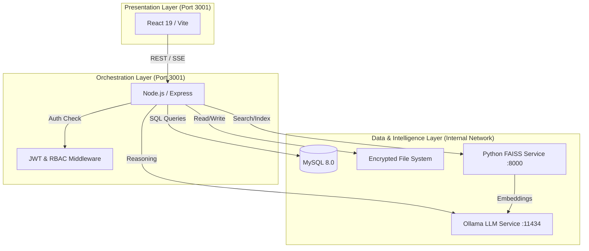

# System Architecture

## 1. Overview
LexiVault is a secure, local-first legal intelligence platform. It is designed as a containerized ecosystem where a Node.js monolith orchestrates Python-based vector operations and local LLM reasoning.

### Core Components
*   **Frontend**: React 19 (Vite) + TypeScript.
*   **Backend**: Node.js (Express) + TypeScript.
*   **Database**: MySQL 8.0 (Relational Metadata).
*   **Vector Service**: Python FastAPI + FAISS (Semantic Search).
*   **AI Engine**: Ollama (Local LLM Inference).
*   **Storage**: Local encrypted file system (The Vault).

## 2. The Triple-Link Architecture
System integrity is maintained by a synchronized "Triple-Link" between three distinct storage systems. A failure in one layer must trigger a rollback or alert to prevent "phantom" data.

| Layer | Technology | Identifier | Purpose |
| :--- | :--- | :--- | :--- |
| **1. Relational** | MySQL | `id` (Auto-INT) | Legal metadata, status, permissions, and audit logs. |
| **2. Binary** | AES-256 Vault | `storage_path` | Encrypted source documents (PDF/DOCX). |
| **3. Semantic** | FAISS / Python | `vector_id` | 768-dimensional vector embeddings for conceptual search. |

**Synchronization Rule**: All mutations are atomic. If a vector push fails, the relational record is marked as `Failed` and the binary file is purged.

## 3. Component Interaction

## 4. Infrastructure Requirements

### Hardware Recommendations
*   **CPU**: 8+ cores (Intel i7/AMD Ryzen 7 or better).
*   **RAM**: 32GB minimum (Critical for running MySQL, Ollama, and FAISS concurrently).
*   **GPU**: NVIDIA RTX 3060+ (12GB VRAM) recommended for low-latency inference.
*   **Storage**: SSD with 50GB+ free space.

### Software Stack
*   **OS**: Linux (Ubuntu 22.04) or Windows 11 (WSL2).
*   **Containerization**: Docker & Docker Compose.
*   **Node.js**: v20+
*   **Python**: v3.9+
