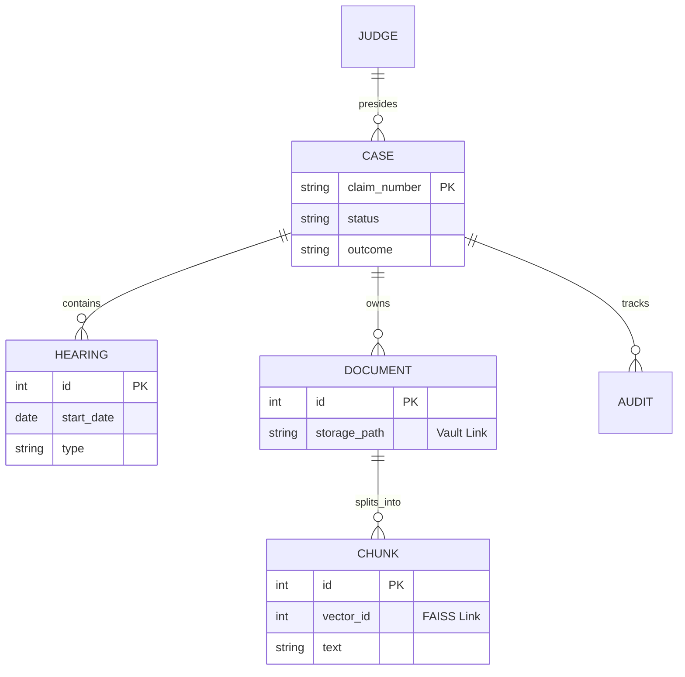

# Database Architecture

## 1. Entity Relationship Model

LexiVault uses a normalized relational model centered around the **Case File** entity.

## 2. The Triple-Link Sync
The database acts as the **Authority of Record** for the Triple-Link system.

1.  **Metadata (MySQL)**: All structured data lives here.
2.  **Binary (Vault)**: `data_scanned_documents.storage_path` points to the encrypted file on disk.
3.  **Semantic (FAISS)**: `semantic_chunks.vector_id` maps a text segment to its mathematical representation in the FAISS index.

**Constraint**: You cannot have a record in FAISS or the Vault without a corresponding entry in MySQL. Orphaned records are purged by the `MAINTENANCE` worker.

## 3. Data Lifecycle

### Active Phase
*   **Ingestion**: Case created, documents uploaded, vectors generated.
*   **Litigation**: Hearings scheduled, outcomes updated.
*   **Search**: High-frequency querying via Dashboard and Chat.

### Finalization
*   Trigger: Judge marks case as `FINALIZED`.
*   Action: `DateFinalized` is set.
*   Impact: Case moves from "Active" to "Recent Judgments" lists.

### Archival (Future)
*   Policy: Cases older than 7 years are moved to cold storage.
*   Action: Vectors removed from FAISS to save RAM. Binaries moved to tape/cold tier. Metadata retained in MySQL.
